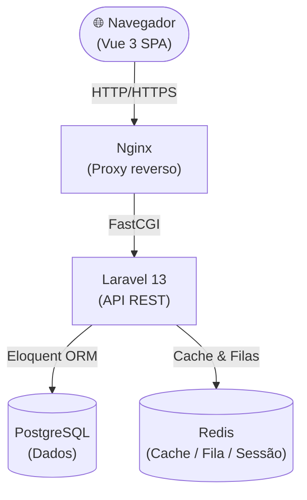
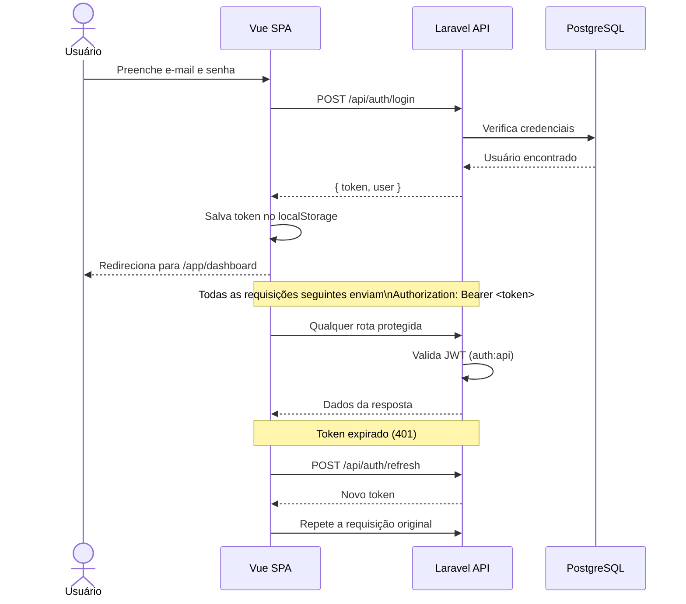
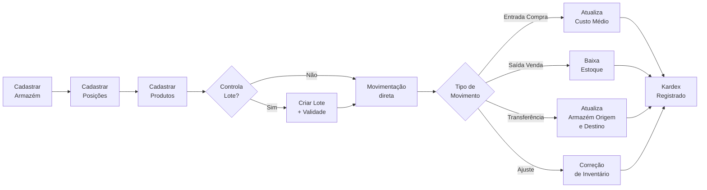
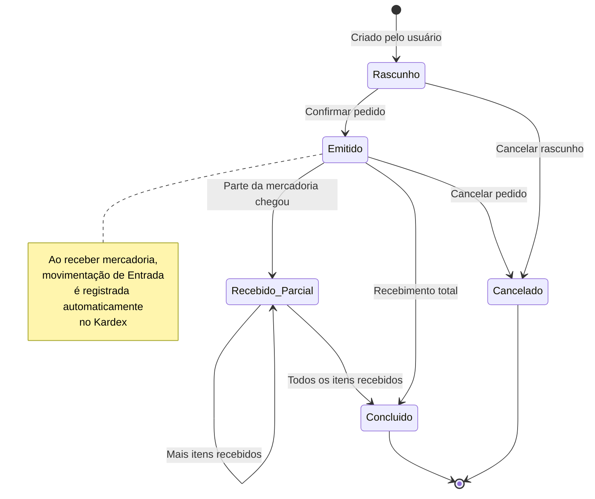
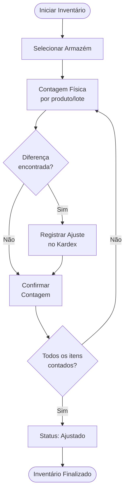

# ngERP — Sistema de Gestão de Estoque

> Laravel 13 · Vue 3 · JWT Auth · PostgreSQL · Redis · TailwindCSS v4 · DaisyUI

---

## Visão Geral

O **ngERP** é uma aplicação SPA (Single Page Application) de gestão de estoque e compras, com autenticação JWT, controle de armazéns, produtos, lotes, movimentações (Kardex), inventário físico e pedidos de compra.

---

## Fluxogramas

### 1. Arquitetura Geral



---

### 2. Fluxo de Autenticação (JWT)



---

### 3. Fluxo de Estoque (Armazéns → Produtos → Movimentações)



---

### 4. Fluxo de Pedido de Compra



---

### 5. Fluxo de Inventário Físico



---

### 6. Navegação do Frontend (Vue Router)


---

## Pré-requisitos

| Ferramenta | Versão mínima |
|------------|---------------|
| PHP        | 8.3+          |
| Composer   | 2.x           |
| Node.js    | 22+           |
| npm        | 10+           |
| PostgreSQL | 16+           |
| Redis      | 7+            |

> **Alternativa:** use Docker (recomendado) — veja abaixo.

---

## Instalação — Desenvolvimento Local

### 1. Clone o repositório

```bash
git clone https://github.com/seu-usuario/ng-erp.git
cd ng-erp
```

### 2. Instale as dependências PHP

```bash
composer install
```

### 3. Configure o ambiente

```bash
cp .env.example .env
php artisan key:generate
```

Edite `.env` com suas credenciais de banco e Redis:

```env
DB_CONNECTION=pgsql
DB_HOST=127.0.0.1
DB_PORT=5432
DB_DATABASE=ngerp
DB_USERNAME=seu_usuario
DB_PASSWORD=sua_senha

REDIS_HOST=127.0.0.1
REDIS_PORT=6379
```

### 4. Gere o segredo JWT

```bash
php artisan jwt:secret
```

### 5. Execute as migrations

```bash
php artisan migrate
```

### 6. Instale as dependências frontend

```bash
npm install
```

### 7. Inicie o ambiente de desenvolvimento

```bash
# Em terminais separados:
php artisan serve        # API Laravel em http://localhost:8000
npm run dev              # Vite em http://localhost:5173
```

Ou use o comando combinado do projeto:

```bash
composer dev
```

> Isso sobe o servidor PHP, o worker de filas, o log watcher e o Vite simultaneamente via `concurrently`.

---

## Instalação — Docker (Recomendado)

### 1. Clone e configure

```bash
git clone https://github.com/seu-usuario/ng-erp.git
cd ng-erp
cp .env.example .env
```

### 2. Suba os containers

```bash
make up
# ou
docker compose -f docker-compose.dev.yml up -d --build
```

### 3. Instale dependências e migre

```bash
make shell
# Dentro do container:
composer install
php artisan key:generate
php artisan jwt:secret
php artisan migrate
exit
```

### 4. Compile o frontend

```bash
make shell
npm install && npm run build
exit
```

A aplicação estará disponível em **http://localhost:80**.

---

## Comandos Úteis

```bash
# Migrations
php artisan migrate
php artisan migrate:fresh --seed   # Zera e resemeia o banco

# Rotas
php artisan route:list --path=api  # Lista todas as rotas da API

# Cache
php artisan config:clear
php artisan route:clear
php artisan cache:clear

# Make (Docker)
make up          # Sobe o ambiente
make down        # Derruba
make shell       # Abre shell no container
make artisan cmd='migrate'
make logs
```

---

## Estrutura de Módulos

```
app/
├── Http/Controllers/
│   ├── AuthController.php          ← Login, Register, Refresh, Me
│   └── Estoque/
│       ├── ArmazemController.php
│       ├── ProdutoController.php
│       ├── FornecedorController.php
│       ├── PedidoCompraController.php
│       ├── MovimentacaoEstoqueController.php
│       └── InventarioController.php
├── Models/                         ← Eloquent models
├── Services/                       ← Regras de negócio
resources/js/
├── api/
│   ├── http.js                     ← Axios + JWT interceptors
│   ├── auth.js                     ← Store de autenticação
│   └── estoque.js                  ← Endpoints do ERP
├── components/
│   ├── DrawerPanel.vue             ← Painel lateral reutilizável
│   └── landing/                   ← Componentes da landing page
├── layouts/
│   └── AppLayout.vue               ← Layout com sidebar responsiva
├── router/index.js                 ← Rotas + navigation guards
└── views/
    ├── auth/                       ← Login e Cadastro
    ├── estoque/                    ← Módulos ERP
    └── LandingPage.vue
```

---

## Licença

MIT © 2026 ngERP
