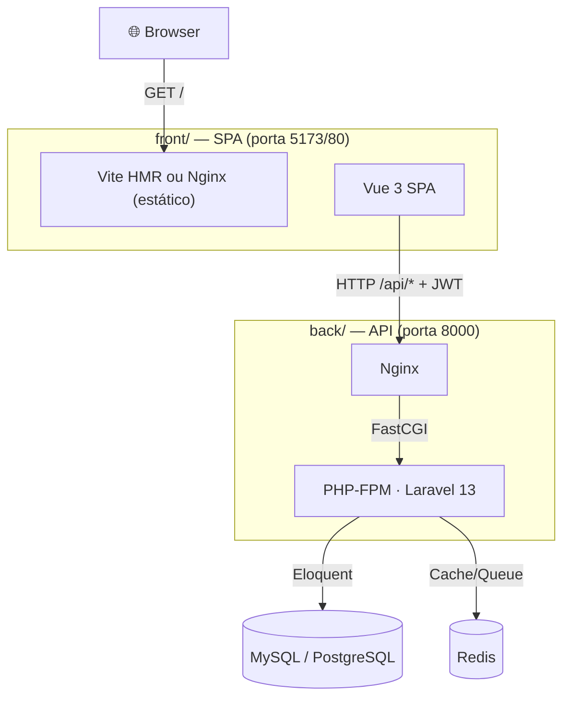

# Caronte ERP — Inventory Management System

> Laravel 13 (API) · Vue 3 (SPA) · JWT Auth · MySQL/PostgreSQL · TailwindCSS v4 · DaisyUI

---

## Visão Geral

**Caronte ERP** é um sistema de gestão de estoque e compras estruturado como **dois microsserviços independentes**:

| Serviço | Diretório | Stack | Porta |
|---------|-----------|-------|-------|
| **API** | `back/` | Laravel 13 + PHP-FPM + Nginx | `8000` |
| **SPA** | `front/` | Vue 3 + Vite + Nginx | `5173` (dev) / `80` (prod) |

Funcionalidades: autenticação JWT, armazéns, posições de estoque, produtos, lotes, movimentações (Kardex), pedidos de compra e inventário físico.

---

## Documentação

| Documento | Descrição |
|-----------|-----------|
| [ARCHITECTURE.md](ARCHITECTURE.md) | Arquitetura detalhada, camadas, convenções e decisões de design |
| [LOCAL_SETUP.md](LOCAL_SETUP.md) | Como rodar localmente com MySQL, sem Docker |

---

## Quick Start — Docker (recomendado)

### Pré-requisitos
- Docker + Docker Compose

### 1. Configurar

```bash
git clone https://github.com/seu-usuario/caronte-erp.git
cd caronte-erp
cp .env.example .env
# Edite .env: DB_PASSWORD, REDIS_PASSWORD, FRONTEND_URL
```

### 2. Subir os containers

```bash
make up
```

Isso inicia:
- `nginx` — API em **http://localhost:8000**
- `frontend` — SPA em **http://localhost:5173** (Vite HMR)
- `pgsql`, `redis`, `mailpit`

### 3. Bootstrap (primeira vez)

```bash
make shell
composer install
php artisan key:generate
php artisan jwt:secret
php artisan migrate
exit
```

---

## Quick Start — Local (sem Docker)

Veja o guia completo em [LOCAL_SETUP.md](LOCAL_SETUP.md).

```bash
# Backend
cd back
composer install
cp .env.example .env   # edite com suas credenciais MySQL
php artisan key:generate && php artisan jwt:secret
php artisan migrate
php artisan serve --port=8000

# Frontend (novo terminal)
cd front
npm install
npm run dev
```

Acesse **http://localhost:5173**.

---

## Arquitetura



---

## Comandos Make

```bash
make up              # sobe o ambiente DEV
make down            # para todos os containers
make shell           # shell no container PHP
make artisan cmd='migrate'
make artisan cmd='route:list --path=api'
make logs            # logs do backend
make logs-front      # logs do frontend (Vite)
make test            # roda PHPUnit
make prod-up         # sobe o ambiente PROD
```

---

## Rotas da API

```
POST   /api/auth/register
POST   /api/auth/login
POST   /api/auth/logout        (JWT)
POST   /api/auth/refresh       (JWT)
GET    /api/auth/me            (JWT)

GET/POST/PUT/DELETE  /api/estoque/warehouses
GET/POST/PUT/DELETE  /api/estoque/suppliers
GET/POST/PUT/DELETE  /api/estoque/products
GET/POST/PUT/DELETE  /api/estoque/purchase-orders
GET/POST/PUT/DELETE  /api/estoque/inventories
GET/POST             /api/estoque/stock-movements
GET                  /api/estoque/stock-movements/{id}
```

---

## License

MIT © 2026 Caronte ERP
