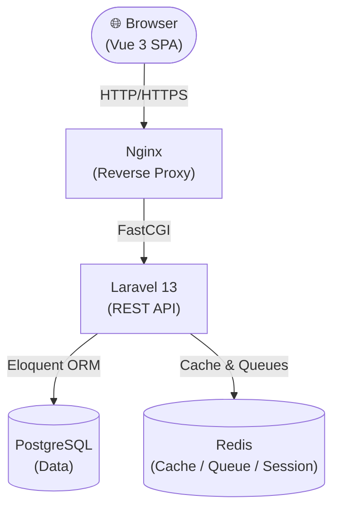
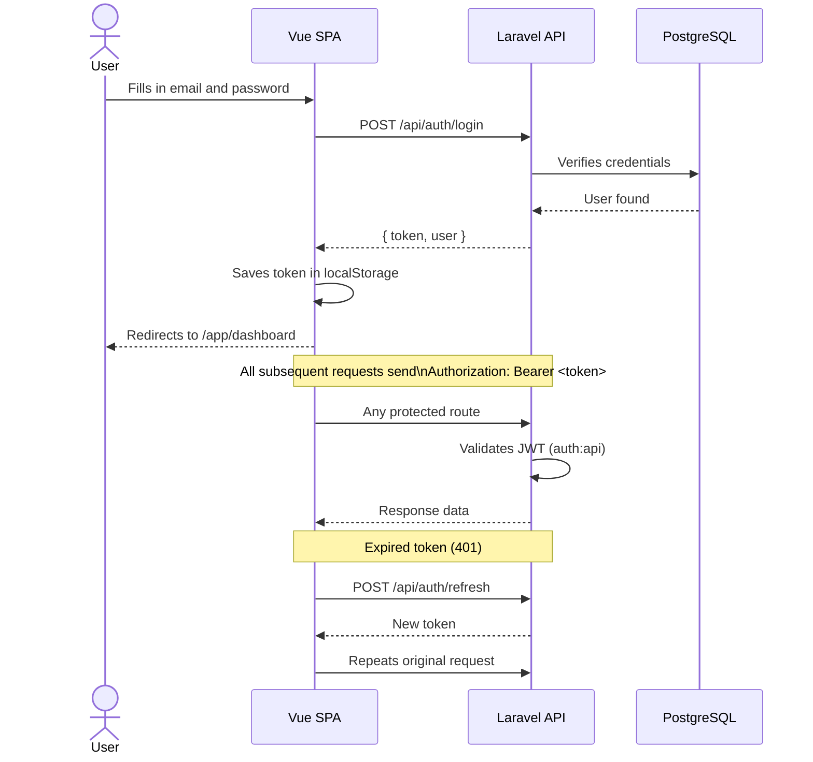
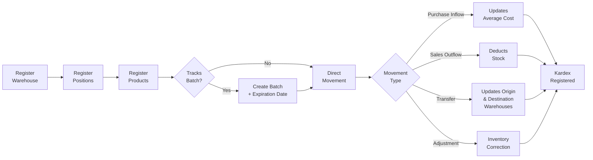
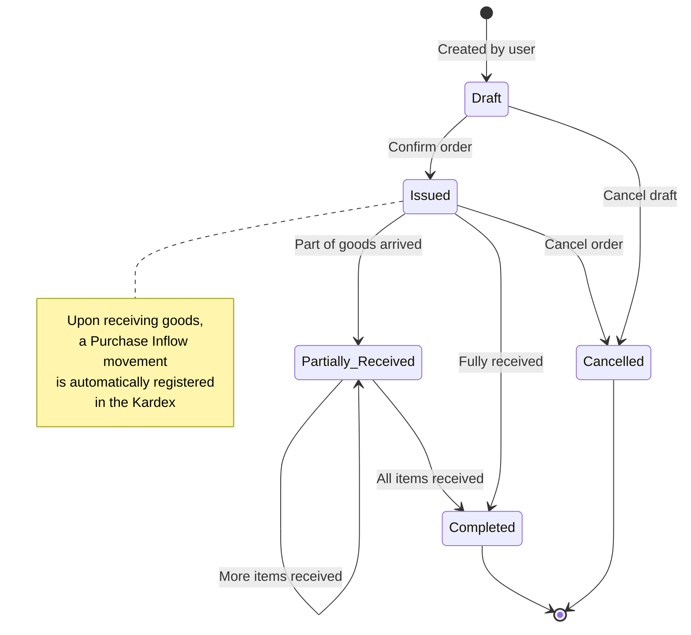
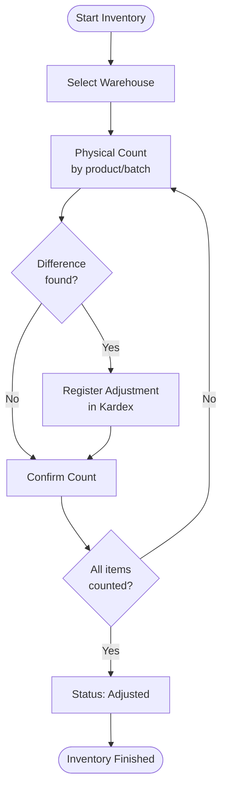
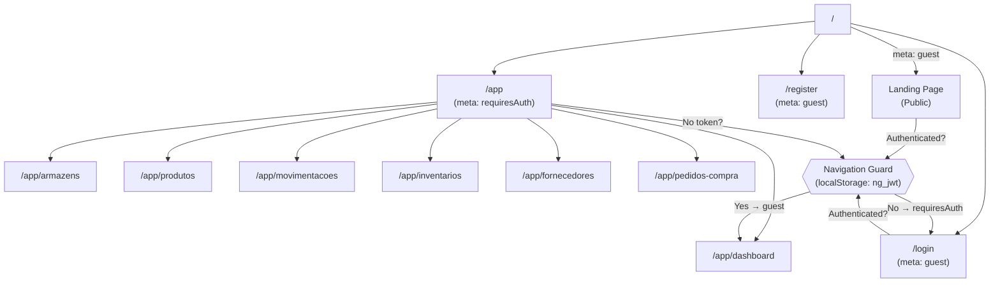

# ngERP — Inventory Management System

> Laravel 13 · Vue 3 · JWT Auth · PostgreSQL · Redis · TailwindCSS v4 · DaisyUI

---

## Overview

**ngERP** is a Single Page Application (SPA) for inventory and purchasing management, featuring JWT authentication, warehouse control, products, batches, stock movements (Kardex), physical inventory, and purchase orders.

---

## Flowcharts

### 1. General Architecture



---

### 2. Authentication Flow (JWT)



---

### 3. Inventory Flow (Warehouses → Products → Movements)



---

### 4. Purchase Order Flow



---

### 5. Physical Inventory Flow



---

### 6. Frontend Navigation (Vue Router)



---

## Prerequisites

| Tool | Minimum Version |
| --- | --- |
| PHP | 8.3+ |
| Composer | 2.x |
| Node.js | 22+ |
| npm | 10+ |
| PostgreSQL | 16+ |
| Redis | 7+ |

> **Alternative:** use Docker (recommended) — see below.

---

## Installation — Local Development

### 1. Clone the repository

```bash
git clone https://github.com/seu-usuario/ng-erp.git
cd ng-erp

```

### 2. Install PHP dependencies

```bash
composer install

```

### 3. Configure the environment

```bash
cp .env.example .env
php artisan key:generate

```

Edit `.env` with your database and Redis credentials:

```env
DB_CONNECTION=pgsql
DB_HOST=127.0.0.1
DB_PORT=5432
DB_DATABASE=ngerp
DB_USERNAME=your_user
DB_PASSWORD=your_password

REDIS_HOST=127.0.0.1
REDIS_PORT=6379

```

### 4. Generate the JWT secret

```bash
php artisan jwt:secret

```

### 5. Run migrations

```bash
php artisan migrate

```

### 6. Install frontend dependencies

```bash
npm install

```

### 7. Start the development environment

```bash
# In separate terminals:
php artisan serve        # Laravel API at http://localhost:8000
npm run dev              # Vite at http://localhost:5173

```

Or use the project's combined command:

```bash
composer dev

```

> This boots up the PHP server, queue worker, log watcher, and Vite simultaneously via `concurrently`.

---

## Installation — Docker (Recommended)

### 1. Clone and configure

```bash
git clone https://github.com/seu-usuario/ng-erp.git
cd ng-erp
cp .env.example .env

```

### 2. Spin up the containers

```bash
make up
# or
docker compose -f docker-compose.dev.yml up -d --build

```

### 3. Install dependencies and migrate

```bash
make shell
# Inside the container:
composer install
php artisan key:generate
php artisan jwt:secret
php artisan migrate
exit

```

### 4. Build the frontend

```bash
make shell
npm install && npm run build
exit

```

The application will be available at **http://localhost:80**.

---

## Useful Commands

```bash
# Migrations
php artisan migrate
php artisan migrate:fresh --seed   # Resets and re-seeds the database

# Routes
php artisan route:list --path=api  # Lists all API routes

# Cache
php artisan config:clear
php artisan route:clear
php artisan cache:clear

# Make (Docker)
make up          # Spins up the environment
make down        # Tears down the environment
make shell       # Opens a shell in the container
make artisan cmd='migrate'
make logs

```

---

## Module Structure

```
app/
├── Http/Controllers/
│   ├── AuthController.php          ← Login, Register, Refresh, Me
│   └── Estoque/
│       ├── ArmazemController.php
│       ├── ProdutoController.php
│       ├── FornecedorController.php
│       ├── PedidoCompraController.php
│       ├── MovimentacaoEstoqueController.php
│       └── InventarioController.php
├── Models/                         ← Eloquent models
├── Services/                       ← Business logic
resources/js/
├── api/
│   ├── http.js                     ← Axios + JWT interceptors
│   ├── auth.js                     ← Authentication store
│   └── estoque.js                  ← ERP endpoints
├── components/
│   ├── DrawerPanel.vue             ← Reusable side panel
│   └── landing/                    ← Landing page components
├── layouts/
│   └── AppLayout.vue               ← Layout with responsive sidebar
├── router/index.js                 ← Routes + navigation guards
└── views/
    ├── auth/                       ← Login and Registration
    ├── estoque/                    ← ERP Modules
    └── LandingPage.vue

```

---

## License

MIT © 2026 ngERP