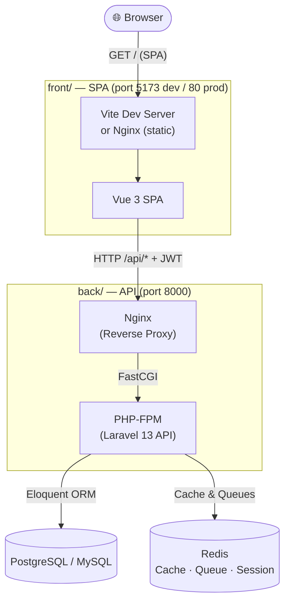
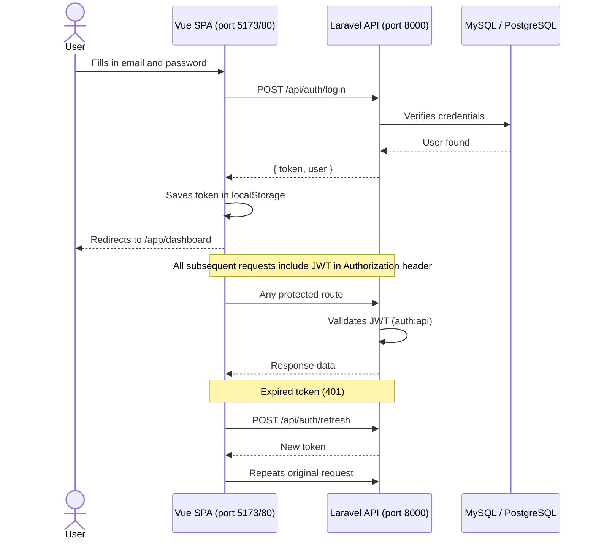
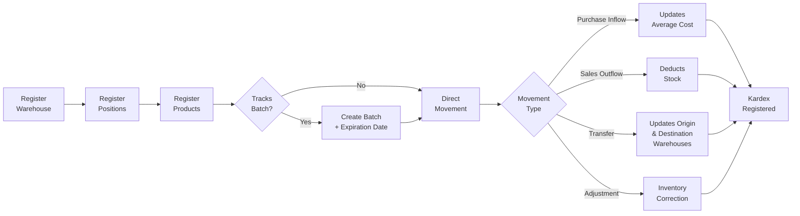
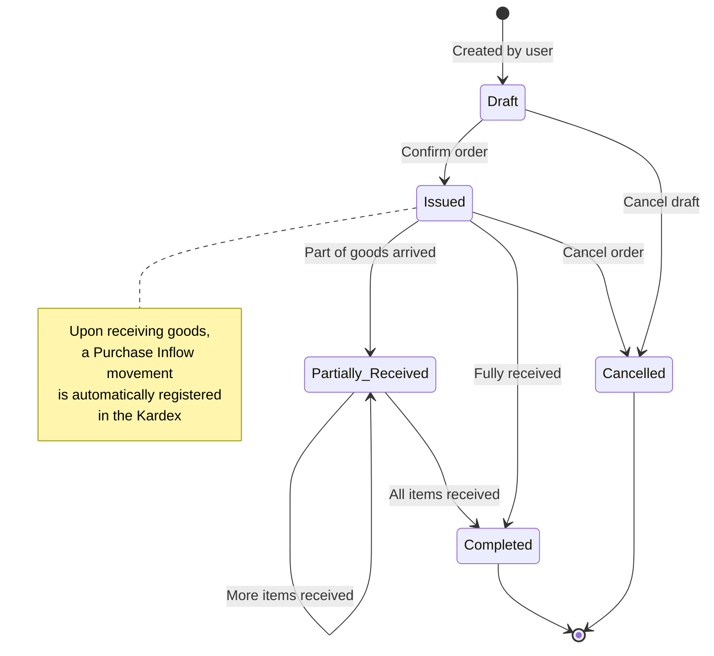
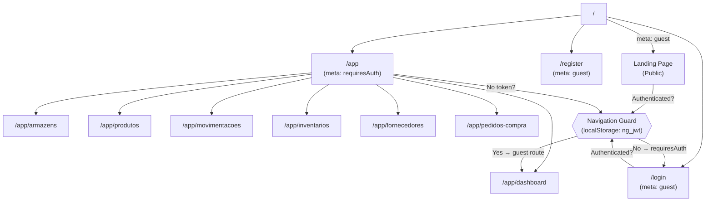
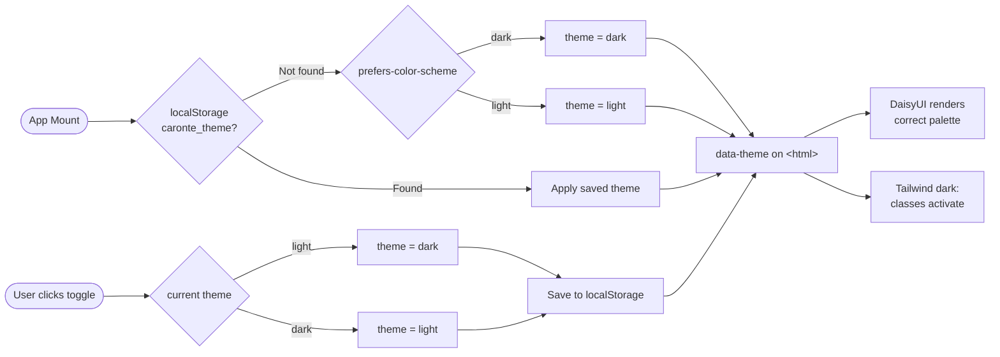

# Caronte ERP — Inventory Management System

> Laravel 13 (API) · Vue 3 (SPA) · JWT Auth · MySQL/PostgreSQL · Redis · TailwindCSS v4 · DaisyUI

---

## Overview

**Caronte ERP** is an inventory and purchasing management system built as two **independent microservices**:

| Service | Directory | Stack | Port |
|---------|-----------|-------|------|
| **API** | `back/` | Laravel 13 + PHP-FPM + Nginx | `8000` |
| **SPA** | `front/` | Vue 3 + Vite + Nginx | `5173` (dev) / `80` (prod) |

Features: JWT authentication, warehouses, stock positions, products, batches, stock movements (Kardex), purchase orders and physical inventory.

---

## Documentation

| Document | Description |
|----------|-------------|
| [ARCHITECTURE.md](ARCHITECTURE.md) | Detailed architecture, layers, conventions and design decisions |
| [LOCAL_SETUP.md](LOCAL_SETUP.md) | How to run locally with MySQL, without Docker |
| [CHANGELOG.md](CHANGELOG.md) | Release notes and version history |

---

## Release Notes

### [Unreleased]

- Microservice architecture: `back/` (Laravel API) and `front/` (Vue 3 SPA) as independent deployable units
- Dark mode support (Tailwind v4 `dark:` variant + DaisyUI themes via `data-theme`)
- `useTheme.js` composable — respects `prefers-color-scheme`, persists in `localStorage`
- Caronte ERP branding with custom SVG logo (256×256 PNG assets)
- MySQL support alongside PostgreSQL (configurable via `DB_CONNECTION`)
- `back/` Dockerfile no longer installs Node.js (frontend has its own container)
- Removed Blade views — backend is now a pure JSON API
- `GET /` root route returns API identification JSON

### v1.0.0 — 2026-07-11

- Initial release
- JWT-authenticated REST API (Laravel 13)
- Vue 3 SPA with Vue Router, Axios interceptors and auto-refresh on 401
- Warehouses, stock positions, suppliers, products, batches
- Purchase orders with state machine (Draft → Issued → Partially Received → Completed)
- Stock movements Kardex (purchase_in, sale_out, transfer, adjustment)
- Physical inventory with automatic Kardex adjustment
- Docker Compose environments for development (PostgreSQL) and production (MySQL)
- Vite proxy for seamless local development without CORS issues

---

## Flowcharts

### 1. Microservice Architecture



---

### 2. Authentication Flow (JWT)



---

### 3. Inventory Flow (Warehouses → Products → Movements)



---

### 4. Purchase Order Flow



---

### 5. Physical Inventory Flow


---

### 6. Frontend Navigation (Vue Router)



---

### 7. Dark Mode Flow



---

## Quick Start — Docker (Recommended)

### Prerequisites
- Docker + Docker Compose

### 1. Configure

```bash
git clone https://github.com/seu-usuario/caronte-erp.git
cd caronte-erp
cp .env.example .env
# Edit .env: DB_PASSWORD, REDIS_PASSWORD, FRONTEND_URL
```

### 2. Start containers

```bash
make up
```

This starts:
- `nginx` — API at **http://localhost:8000**
- `frontend` — SPA at **http://localhost:5173** (Vite HMR)
- `pgsql`, `redis`, `mailpit`

### 3. Bootstrap (first run only)

```bash
make shell
composer install
php artisan key:generate
php artisan jwt:secret
php artisan migrate
exit
```

---

## Quick Start — Local (without Docker)

See the full guide at [LOCAL_SETUP.md](LOCAL_SETUP.md).

```bash
# Backend
cd back
composer install
cp .env.example .env   # edit with your MySQL credentials
php artisan key:generate && php artisan jwt:secret
php artisan migrate
php artisan serve --port=8000

# Frontend (new terminal — load NVM first if needed: source ~/.nvm/nvm.sh)
cd front
npm install
npm run dev
```

Access **http://localhost:5173**.

---

## Make Commands

```bash
make up              # start all DEV services
make down            # stop all containers
make shell           # shell into the PHP container
make artisan cmd='migrate'
make artisan cmd='route:list --path=api'
make logs            # backend logs
make logs-front      # frontend (Vite) logs
make test            # run PHPUnit
make prod-build      # build production images
make prod-up         # start PROD environment
make prod-down       # stop PROD environment
```

---

## API Routes

```
GET    /                               API identification (JSON)
GET    /up                             Health check

POST   /api/auth/register
POST   /api/auth/login
POST   /api/auth/logout                (JWT required)
POST   /api/auth/refresh               (JWT required)
GET    /api/auth/me                    (JWT required)

GET/POST/PUT/DELETE  /api/estoque/warehouses
GET/POST/PUT/DELETE  /api/estoque/suppliers
GET/POST/PUT/DELETE  /api/estoque/products
GET/POST/PUT/DELETE  /api/estoque/purchase-orders
GET/POST/PUT/DELETE  /api/estoque/inventories
GET/POST             /api/estoque/stock-movements
GET                  /api/estoque/stock-movements/{id}
```

---

## Prerequisites

| Tool | Minimum Version |
|------|----------------|
| PHP | 8.3+ |
| Composer | 2.x |
| Node.js | 22+ |
| npm | 10+ |
| MySQL | 8.0+ |
| PostgreSQL | 16+ (Docker) |
| Redis | 7+ (Docker) |

---

## Project Structure

```
caronte-erp/
├── back/                    ← Laravel 13 API (pure JSON, no views)
│   ├── app/                 ← Controllers, Models, Services, Requests, Resources
│   ├── bootstrap/app.php    ← API-only routing configuration
│   ├── config/              ← cors.php, jwt.php, database.php…
│   ├── database/migrations/ ← All 10 migrations
│   ├── routes/
│   │   ├── api_erp_estoque.php  ← All API routes
│   │   └── console.php
│   ├── tests/               ← Feature + Unit tests
│   ├── Dockerfile.dev       ← PHP-FPM dev image (no Node)
│   └── Dockerfile.prod      ← PHP-FPM prod image
│
├── front/                   ← Vue 3 SPA
│   ├── src/
│   │   ├── main.js          ← Entry point
│   │   ├── App.vue          ← Root component + theme init
│   │   ├── app.css          ← Tailwind v4 + DaisyUI + dark mode variant
│   │   ├── composables/useTheme.js  ← Dark mode toggle
│   │   ├── api/             ← http.js (Axios+JWT), auth.js, estoque.js
│   │   ├── components/      ← DrawerPanel + landing components
│   │   ├── layouts/         ← AppLayout (sidebar + topbar)
│   │   ├── router/          ← Routes + navigation guard
│   │   └── views/           ← Pages: auth, dashboard, stock modules
│   ├── public/              ← favicon.ico, logo*.png
│   ├── prototype/           ← Static HTML prototype reference
│   ├── Dockerfile.dev       ← Node dev container (Vite HMR)
│   └── Dockerfile.prod      ← Multi-stage: build → Nginx static
│
├── docker/                  ← Nginx, PHP-FPM, MySQL, Supervisor configs
├── docker-compose.dev.yml
├── docker-compose.prod.yml
├── Makefile
├── ARCHITECTURE.md          ← Full architecture context
├── LOCAL_SETUP.md           ← Local development guide
└── CHANGELOG.md             ← Version history
```

---

## License

MIT © 2026 Caronte ERP
